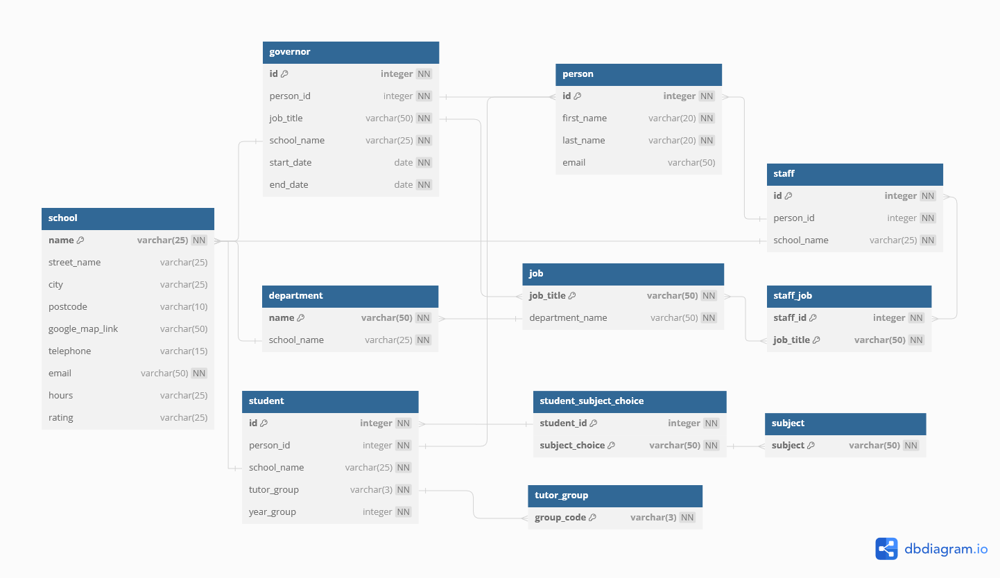

# Data Engineer Projects

These projects were created as part of [Codecademy's](https://www.codecademy.com) Data Engineer Career Path course. (Latest projects are added to the top of the list.)

There were several portfolio projects created as part of this course. As they were larger and more extensive programs they can be found in their own repositories:

- Portfolio Project: GitHub Data Engineering Portfolio (TODO)
- Portfolio Project: Subscriber Cancellations Data Pipeline (TODO)
- Portfolio Project: Bike Rental Data Management (TODO)

I have previously completed a number of the projects within [Python Fundamentals](#python-fundamentals) and all of the projects within [SQL Fundamentals](#sql-fundamentals) as part of [Codecademy's](https://www.codecademy.com) Computer Science Career Path course. For completeness, I have included the projects here as well, and have marked them with a \*.

## Table of contents

- Learn MongoDB
- Learn Git II: Git For Deployment
- Learn Git: Introduction To Version Control
- Advanced Python
- Learn The Command Line
- Intermediate Python
- Introduction To Big Data With PySpark
- Getting Started Off-Platform
- Data Wrangling, Cleaning And Tidying
- Advanced SQL
- Python Pandas
- [SQL Fundamentals](#sql-fundamentals) \*
  - [Building An Inventory Database With PostgreSQL](#building-an-inventory-database-with-postgresql) \*
  - [Designing A Database From Scratch](#designing-a-database-from-scratch) \*
  - [Build A Menu For Bytes Of China](#build-a-menu-for-bytes-of-china) \*
  - [Lyft Trip Data](#lyft-trip-data) \*
  - [Analyse Hacker News Trends](#analyse-hacker-news-trends) \*
  - [Trends In Startups](#trends-in-startups) \*
  - [New York Restaurants](#new-york-restaurants) \*
  - [Create A Table](#create-a-table) \*
- [Python Fundamentals](#python-fundamentals)
  - [Hacking The Fender](#hacking-the-fender) \*
  - [Coded Correspondence](#coded-correspondence) (TODO)
  - [Thread Shed](#thread-shed) \*
  - [Abruptly Goblins](#abruptly-goblins) (TODO)
  - [Scrabble](#scrabble) \*
  - [Basta Fazoolin'](#basta-fazoolin) (TODO)
  - [Getting Ready For Physics Class](#getting-ready-for-physics-class) \*
  - [Time Travelers Toolkit](#time-travelers-toolkit) (TODO)
  - [Carly's Clippers](#carlys-clippers) \*
  - [Len's Slice](#lens-slice) \*
  - [Gradebook](#gradebook) \*
  - [Sal's Shipping](#sals-shipping) \*
  - [Magic 8-Ball](#magic-8-ball) \*
- [Other](#other)
  - [Author](#author)

# SQL Fundamentals

## Building An Inventory Database With PostgreSQL

The aim of this project was to set constraints on a database used for keeping track of parts, their manufacturer, location in storeroom, inventory etc, to enable data quality checks to ensure that only valid data can be entered into the database.

The database had the initial following schema:


To ensure data quality the following were utilised on the tables as appropriate:

- `ADD UNIQUE (column_name)`
- `ALTER COLUMN column_name SET NOT NULL`
- `ADD CHECK (appropriate limitation)`
- `ADD PRIMARY KEY (column_name)`
- `ADD FOREIGN KEY (column_name) REFERENCES table_name(column_name)`

### Code & Potential Improvements

- Solution URL: [Building An Inventory Database With PostgreSQL](./sql-fundamentals/building_an_inventory_database_with_postgresql.sql)

## Designing A Database From Scratch

The aims of this project were to:

- Design a database schema on any topic.
- Implement the schema using Postbird (which is an open source PostgreSQL GUI client).

I chose to design a database around a hypothetical UK secondary school. I focused the database around people who would be closely associated with the school and how they are linked together to decide on what information to add and how to organise it. I designed the following schema for the database (I've included the [DBML database markup language file](./sql-fundamentals/school.dbml)):



I got ChatGPT to generate hypothetical data based of the schema:


While using ChatGPT helped speed up the generation of data, it didn't keep the data consistent to what it was supposed to add for each individual. For instance, it added a staff member with a note to state they were an art teacher, but never added art teacher as a job. So there were some inconsistencies when trying to add the data that I needed to clear up when inserting data into the table.

### Code & Potential Improvements

- Solution URL: [Designing A Database From Scratch](./sql-fundamentals/school.sql)

- I added a few test queries to check that I could pull out information appropriately and as expected.

## Build A Menu For Bytes Of China

The aim of this project was to design a database schema based around a fictional restaurant "Bytes of China" and perform the following tasks:

- Create tables
- Define relationships between tables
- Designate appropriate columns as keys
- Insert sample data and
- Make queries from the database

The database has the following schema:


I learnt how to use [dbdiagram.io](https://dbdiagram.io) to create an accurate schema and also how to validate and check keys and relationships in the database using `information_schema.key_column_usage`:

```sql
SELECT
   constraint_name,
   table_name,
   column_name
FROM information_schema.key_column_usage
WHERE table_name = 'restaurant';
```

### Code & Potential Improvements

- Solution URL: [Build A Menu For Bytes Of China](./sql-fundamentals/build_a_menu_for_bytes_of_china.sql)

## Lyft Trip Data

The aim of this project was make queries to a database containing multiple tables of Lyft trip data information using SQL commands knowledge to date and using `JOIN` and `UNION` commands. The database tables have the following schema:


- Example use of `LEFT JOIN` where it was used to create a trip log with the trips and its users:
  ```sql
  SELECT trips.date,
    trips.pickup,
    trips.dropoff,
    trips.type,
    trips.cost,
    riders.first,
    riders.last,
    riders.username
  FROM trips
  LEFT JOIN riders
    ON trips.rider_id = riders.id;
  ```

### Code & Potential Improvements

- Solution URL: [Lyft Trip Data](./sql-fundamentals/lyft_trip_data.sql)

## Analyse Hacker News Trends

The aim of this project was make queries to a database table of Hacker News stories information using SQL commands knowledge to date and along with `strftime()` function. The database table has the following schema:


- Example use of `strftime()` where it was used to find the best time for users to post news stories to get the best scores:
  ```sql
  SELECT strftime('%H', timestamp) AS 'Hour',
    ROUND(AVG(score), 1) AS 'Average Score',
    COUNT(*) AS 'Number of Stories'
  FROM hacker_news
  WHERE timestamp IS NOT NULL
  GROUP BY 1
  ORDER BY 2 DESC;
  ```

### Code & Potential Improvements

- Solution URL: [Analyse Hacker News Trends](./sql-fundamentals/analyse_hacker_news_trends.sql)

## Trends In Startups

The aim of this project was make queries using aggregate functions to a database table of startup companies information using SQL commands. The database table has the following schema:


- Aggregate functions used: `COUNT()`, `SUM()`, `MAX()`, `MIN()`, `AVG()`, `ROUND()`
- `GROUP BY column_name;`
- `HAVING aggregrate function conditon;`

### Code & Potential Improvements

- Solution URL: [Trends In Startups](./sql-fundamentals/trends_in_startups.sql)

## New York Restaurants

The aim of this project was make queries to a database table of restaurant information using SQL commands. The database table has the following schema:


- `SELECT DISTINCT column_name FROM table_name;`
- `WHERE column_name condition;`
- `WHERE column_name LIKE pattern;`
- `WHERE column_name condition AND or OR column_name condition;`
- `WHERE column_name IS NULL;`
- `ORDER BY column_name DESC LIMIT number;`
- Also used `CASE`, `WHEN`, `THEN`, `ELSE`, `END AS`
  ```sql
  SELECT name,
    CASE
      WHEN review > 4.5 THEN 'Extraordinary'
      WHEN review > 4 THEN 'Excellent'
      WHEN review > 3 THEN 'Good'
      WHEN review > 2 THEN 'Fair'
      ELSE 'Poor'
    END AS 'Review'
  FROM nomnom;
  ```

### Code & Potential Improvements

- Solution URL: [New York Restaurants](./sql-fundamentals/new_york_restaurants.sql)

## Create A Table

The aim of this project was to create a friends table and add/delete data to it using basic SQL commands.

- `CREATE TABLE table_name (column_name data_type);`
- `INSERT INTO table_name (column_name) VALUES (data);`
- `SELECT column_name or * FROM table_name;`
- `UPDATE table_name SET column_name = data;`
- `ALTER TABLE table_name ADD COLUMN column_name data_type;`
- `DELETE FROM table_name WHERE column_name = data;`

### Code & Potential Improvements

- Solution URL: [Create A Table](./sql-fundamentals/create_a_table.sql)

# Python Fundamentals

## Hacking The Fender

The aim of this project was to create a Python program that reads and writes to files. Extracting `Username` information from `passwords.csv` to create a list of user names in `compromised_user.csv`. Creating `boss_message.json` and `new_passwords.csv`.

- Imported `csv`, `json` and `os`.
- `with open("file_name", "w")` used to write files, "w" omitted when using only for reading.
- `csv.DictReader()` used to read passwords.csv file.
- `json.dump(dictionary_name, json_file_name)` used to write information to json file from Python dictionary.
- `file_object.write("text_to_add")` used to write information to file.

### Code & Potential Improvements

- Solution URL: [Hacking The Fender](./python-fundamentals/hacking_the_fender.py)
- Other files:
  - [boss_message.json](./python-fundamentals/boss_message.json)
  - [compromised_users.txt](./python-fundamentals/compromised_users.txt)
  - [new_passwords.csv](./python-fundamentals/new_passwords.csv)
  - [passwords.csv](./python-fundamentals/passwords.csv)

## Coded Correspondence

The aim of this project was to ... (TODO)

### Code & Potential Improvements

- Solution URL: [Coded Correspondence]() (TODO)

## Thread Shed

The aim of this project was to create a Python program that takes a list of sales information in a string format (customer name, price, colour(s) of thread purchased and date), and then use a variety of techniques to clean up the data into easier-to-access information.

- `string.replace()` used to help with clarifying appropriate sales transaction.
- `string.split()` used to help split up string into appropriate sections.
- `string.strip()` used to clear up and remove whitespace in transaction information.
- `for` loops used to iterate through lists of transactions.
- `list.append` to add information into smaller appropriate groups of lists e.g. customers, sales price and colour of thread purchased.
- Function defined to calculate the total numbers sold for each colour thread.
- `print` and `.format()` used to print out a formatted string of the number of each colour thread purchased.

### Code & Potential Improvements

- Solution URL: [Thread Shed](./python-fundamentals/thread_shed.py)

## Abruptly Goblins

The aim of this project was to ... (TODO)

### Code & Potential Improvements

- Solution URL: [Abruptly Goblins]() (TODO)

## Scrabble

The aim of this project was to create a Python program that processes some data from a group of friends playing scrabble. Dictionaries are used to organise players, words and points.

- List comprehension used to create a dictionary from two provided lists of letters and their points.

  ```python
  letters_to_points = {key:value for key, value in zip(letters, points)}
  ```

- Functions defined to:

  - `play_word()` adds a new word played by a player.

    - Sets `word.upper()` as letters in letters_to_points dictionary are all uppercase.
    - Sets `player.title()` so that if names are entered differently with lowercase or uppercase letters they will still match when compared to `player_to_words` dictionary.
    - If player already exists, word is added to their played list in player_to_words dictionary.
    - If player doesn't exist, then the new player along with their word is added to player_to_words dictionary.
    - Calls `update_point_totals()` function.

  - `update_point_totals()` updates the total points scored for the player.

    - Calls `score_word()` function.
    - If player already exists, points are added to their total score in player_to_points dictionary.
    - If player doesn't exist, then the new player along with their score is added to player_to_points dictionary.

  - `score_word()` calculates and returns the points score of a word.

  - `play_round()` initialises the program.

    - Gets player name and word from user.
    - Calls `play_word()` function.
    - Calls `another_round()` function.

  - `another_round()` asks user whether they wish to enter another player's word.

    - Gets Y/N input from user. Input changed to uppercase.
    - If response is `Y` or `YES`, then calls `play_round()` function.
    - If response not `Y` or `YES`, then calls `show_results()` function.

  - `show_results()` iterates through `player_to_points` dictionary to print out names and total scores of each player.

### Code & Potential Improvements

- Solution URL: [Scrabble](./python-fundamentals/scrabble.py)
  - Remove hardcoded player's data and ask for input of name and word from user - ADDED TO CODE.
  - Check whether more words to be added and scored - ADDED TO CODE.
  - Show overall results of players in formatted strings - ADDED TO CODE.

## Basta Fazoolin'

The aim of this project was to ... (TODO)

### Code & Potential Improvements

- Solution URL: [Basta Fazoolin']() (TODO)

## Getting Ready For Physics Class

The aim of this project was to create a Python program that uses functions and `return` to help calculate some fundamental physics properties.

- Functions defined to calculate:
  - Fahrenheit to Celsius temperatures
  - Celsius to Fahrenheit temperatures
  - Force
  - Energy
  - Work
- Values to test the program are hardcoded into the program.

### Code & Potential Improvements

- Solution URL: [Getting Ready For Physics Class](./python-fundamentals/getting_ready_physics_class.py)
  - Have the user choose which physics property to calculate.
  - Have the user enter appropriate values for the physics property they have chosen to calculate.

## Time Travelers Toolkit

The aim of this project was to ... (TODO)

### Code & Potential Improvements

- Solution URL: [Time Travelers Toolkit]() (TODO)

## Carly's Clippers

The aim of this project was to create a Python program that calculates some metrics from lists of data.

- Lists of hairstyles, prices and last week's sales are hardcoded into the program.
- `for`, list comprehensions, `range()`, `len()` and `if` are used to calculate average prices, decreased prices, total revenue, average daily revenue and types of haircuts that cost less than £30.

### Code & Potential Improvements

- Solution URL: [Carly's Clippers](./python-fundamentals/carlys_clippers.py)

## Len's Slice

The aim of this project was to create a Python program that takes pizzas and their prices using lists and alters the lists to organise the data.

- 2D lists of pizzas and prices are hardcoded into the program.
- `list.count(item)` used to count how many pizzas are $2.
- `len(list)` used to count the number of different kinds of pizzas.
- `list.sort()` to sort the list in ascending order of price.
- `list.pop()` to remove the most expensive pizza.
- `list.insert(index, item)` to add a new pizza in appropriate position to keep price sorted in list.
- `list[:3]` to find the cheapest three pizzas.

### Code & Potential Improvements

- Solution URL: [Len's Slice](./python-fundamentals/lens_slice.py)

## Gradebook

The aim of this project was to create a Python program that takes student data and organizes subjects and grades using lists.

- 2D lists of subjects and grades are hardcoded into the program.
- `list.append(item)`, `list[index].remove(item)` are used to alter subjects and grades and `print()` out gradebook information to the user.

### Code & Potential Improvements

- Solution URL: [Gradebook](./python-fundamentals/gradebook.py)
  - Have the user input the initial subjects and grades.
  - Have the user be able to alter subjects and grades.

## Sal's Shipping

The aim of this project was to create a Python program that asks the user for the weight of their package and then tells them which method of shipping is cheapest and how much it will cost to ship their package using Sal’s Shippers.

- `weight` variable is hardcoded into the program.
- `if`, `elif` and `else` used to calculate cost shipping and `print()` out costs.

### Code & Potential Improvements

- Solution URL: [Sal's Shipping](./python-fundamentals/shipping.py)
  - Have the user input the packages weight.

## Magic 8-Ball

The aim of this project was to create a Python program that can answer any "Yes" or "No" question with a different fortune each time it executes.

- `name` and `question` variables are hardcoded into the program.
- `random` module with `randint()` used to generate a random number within a specified range.
- `if`, `elif` and `else` used to select answers and `print()` out appropriate response.

### Code & Potential Improvements

- Solution URL: [Magic 8-Ball](./python-fundamentals/magic-8.py)
  - Have the user input their name and question.

# Other

## Author

- V. Tickner
